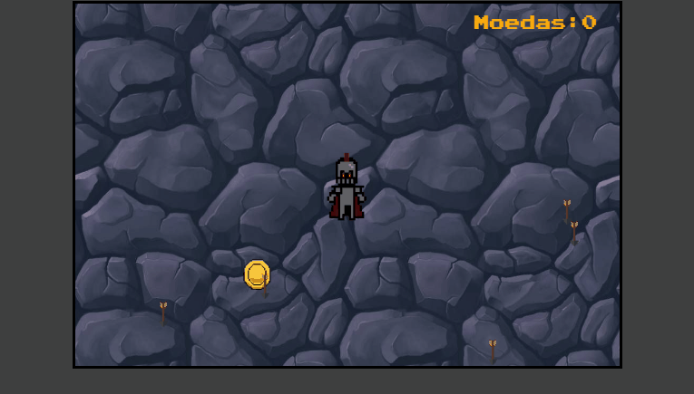

<div align="center">

# Linguagem de Programação para Animação Web
</div>

## Smile Game


<hr>

## Knight Game



> Jogos desenvolvidos para a disciplina de linguagem de programação para animação web no curso de Tecnologia em Sistemas para Internet.

<hr>

### Como Jogar?
Teclas: W A S D
<br>
Reiniciar : F5

<hr>

Clone este projeto.

```bash
git clone https://github.com/DenerBorges/LPAW.git

```
Execute este comando para instalar as dependências.

```bash
npm install

npm rum dev

```
